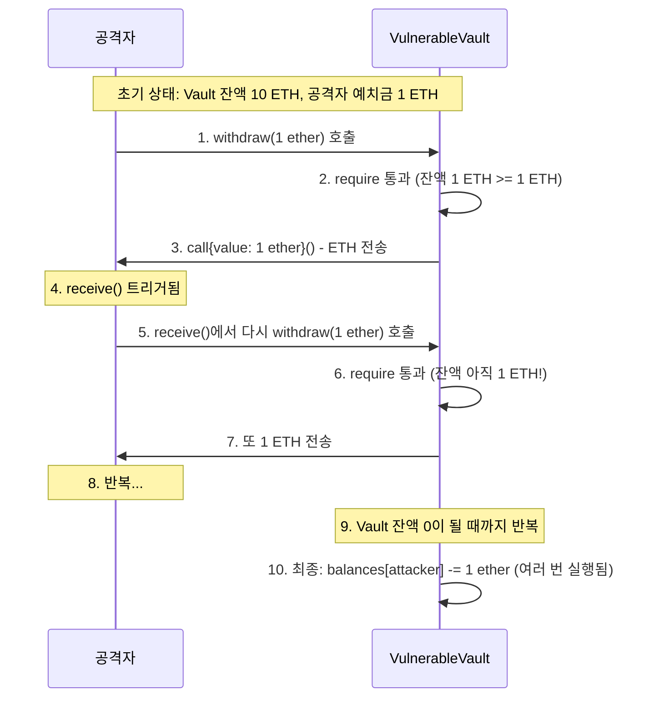

# Week 3 퀴즈: EVM/Security patterns

**제출 방법:**
1. 이 파일을 복사하여 `quiz-03-solution.md`로 저장
2. 각 문제에 답변 작성 (왜 그런지 설명 포함)
3. Pull Request 생성 (`quiz_submission` 템플릿 사용)

**평가 기준:**
- 정답 여부보다 **개념 이해도**를 중점 평가합니다
- 특히 **보안 취약점 식별과 방어 패턴**을 중점 평가합니다
- 코드 문제는 문법보다 보안 논리를 평가합니다

---

## 문제 1: [이론] EVM 개념 (객관식)

EVM(Ethereum Virtual Machine)이 "결정론적(deterministic)"으로 실행되어야 하는 이유는?

**보기:**
A) 모든 노드가 같은 CPU를 사용해야 하므로
B) 모든 노드가 같은 입력에 대해 같은 결과를 얻어야 합의가 가능하므로
C) 트랜잭션 처리 속도를 높이기 위해
D) 개발자가 코드를 디버깅하기 쉽게 하기 위해

**답변:**
<!--
정답과 함께, EVM에서 랜덤 함수나 외부 API 호출이 금지된 이유를 설명하세요.
-->
B. 블록체인은 수많은 노드가 동일한 트랜잭션을 독립적으로 수행하는 데 이때 노드 간 계산값이 다르다면 상태가 갈라지고 합의가 불가능 하기에 결정론적으로 실행되어야 한다. 그렇기에 랜덤함수, 외부 API호출 등이 금지되어 있다.


---

## 문제 2: [이론] Storage vs Memory (객관식)

다음 코드에서 `data` 변수의 저장 위치와 특성을 올바르게 설명한 것은?

```solidity
function process(uint[] memory data) public pure returns (uint) {
    uint sum = 0;
    for (uint i = 0; i < data.length; i++) {
        sum += data[i];
    }
    return sum;
}
```

**보기:**
A) Storage에 저장되며 함수 종료 후에도 유지된다
B) Memory에 저장되며 함수 종료 시 삭제된다
C) Stack에 저장되며 가장 비싼 저장 공간이다
D) Calldata에 저장되며 수정이 가능하다

**답변:**
<!--
정답과 함께, Storage/Memory/Stack의 비용 차이를 간단히 설명하세요.
힌트: 어떤 것이 가장 비싸고, 왜 비싼가요?
-->
B. memory data라고 명시되어 있기에 memory애 저장됨을 알 수 있다. Storage는 모든 노드에 영구적으로 저장되기에 가장 비싸다. 다음으로 memory는 함수 실행 중에만 임시로 저장되며 함수가 종료될 시 사라지기에 Storage보다는 저렴하다. stack은 evm이 연산을 할때 사용하며 매우 빠르며 수명 또한 매우 짧아 굉장히 저렴하다. 마지막으로 calldata는 읽기 전용으로 복사를 하지 않아 가장 저렴하며 수정은 불가능하다.

---

## 문제 3: [이론] Gas 비용 (객관식)

다음 중 Gas 비용이 가장 높은 연산은?

**보기:**
A) ADD (덧셈)
B) MUL (곱셈)
C) SLOAD (Storage 읽기)
D) SSTORE (Storage 쓰기)

**답변:**
<!--
정답과 함께, 왜 Storage 관련 연산이 비싼지 설명하세요.
힌트: Storage에 저장된 데이터는 어떤 특성이 있나요?
-->
D. Storage 관련 연산은 위에서도 언급하였듯이 전세계의 모든 노드에 영구적으로 저장, 동기화를 진행하기에 비싸다. 이때 읽기인 SLOAD는 상태 변경은 없기에 조사해 보니 가스비가 약 2100, SSTORE은 약 20000정도이라고 한다.

---

## 문제 4: [이론] CEI 패턴 (단답형)

**왜** CEI(Checks-Effects-Interactions) 패턴에서 Effects(상태 변경)가 Interactions(외부 호출)보다 먼저 와야 하나요?

재진입 공격 시나리오와 연결해서 구체적으로 설명하세요.

**답변:**
<!--
2-3 문장으로 설명하세요.
힌트:
- 외부 호출 시 상대방 컨트랙트의 코드가 실행됨
- 그 코드에서 다시 원래 함수를 호출하면?
- 상태가 변경되지 않은 상태라면 어떻게 될까요?
-->
외부 호출 시 상대방의 악의적인 컨트랙트 코드가 다시 원래의 함수를 호출하였는 데 상태 변경이 외부 호출보다 뒤에 왔다면 상태가 변경되지 않았었기에 다시 재진입 공격이 가능하다. 그렇기에 상태변경을 외부호출 이전에 하고 외부 호출을 해야한다.

---

## 문제 5: [이론] The DAO 사건 교훈 (단답형)

2016년 The DAO 해킹($60M 피해)에서 우리가 배워야 할 **가장 중요한 교훈**은 무엇인가요?

이 사건 이후 이더리움 생태계에 어떤 변화가 있었나요?

**답변:**
<!--
2-3 문장으로 설명하세요.
교훈:
- 기술적 교훈 (코드 작성 관점)
- 생태계 교훈 (이더리움 커뮤니티 관점)
-->
 기술적 교훈으로는 CEI와 같이 외부 호출 이전에 상태 변경을 꼭 해야하여 재진입 공격에 대해 방지책을 세워야한다. 생태계 교훈으로는 The DAO 해킹 이후 위기 시 거버넌스와 사회적 합의, 하드 포크 등의 요소도 중요함을 알 수 있다.

---

## 문제 6: [코드] 재진입 공격 식별 (취약점 찾기)

다음 코드에서 재진입 공격 취약점을 찾으세요:

```solidity
// BAD CODE - 취약점 찾기
contract VulnerableVault {
    mapping(address => uint256) public balances;

    function deposit() public payable {
        balances[msg.sender] += msg.value;
    }

    function withdraw(uint256 amount) public {
        require(balances[msg.sender] >= amount, "Insufficient balance");

        // ETH 전송
        (bool success, ) = msg.sender.call{value: amount}("");
        require(success, "Transfer failed");

        // 잔액 차감
        balances[msg.sender] -= amount;
    }
}
```

**1) 발견한 취약점:**
<!--
취약점 이름과 위치를 명시하세요.
힌트: withdraw 함수의 순서를 자세히 보세요.
-->
현재 상태 변경인 잔액 차감과 외부 호출인 ETH 전송이 순서가 외부호출이 먼저 와서 재진입 공격에 취약하다.

**2) 왜 이것이 문제인가:**
<!--
공격자가 어떻게 이 취약점을 악용할 수 있는지 단계별로 설명하세요.
-->
공격자가 1ETH를 deposit 함수를 통해 입금한 후 다시 withdraw 함수를 실행한다. 이때 외부 호출이 이루어지고 상태 변경이 일어나기 사이에 다시 재진입을 하면 require조건에 걸리지 않기에 또 다시 ETH를 출금하는 재진입 공격을 할 수 잇다.


**3) 올바른 수정 방법 (CEI 패턴):**
```solidity
// GOOD CODE - CEI 패턴으로 수정하세요
function withdraw(uint256 amount) public {
    require(balances[msg.sender] >= amount, "Insufficient balance");

    balances[msg.sender] -= amount;

    (bool success, ) = msg.sender.call{value: amount}("");
    require(success, "Transfer failed");
}
```

---

## 문제 7: [코드] CEI 패턴 구현 (빈칸 채우기)

다음 코드의 빈칸을 채워 CEI 패턴을 완성하세요:

```solidity
function secureWithdraw(uint256 amount) public {
    // 1. Checks - 조건 확인
    require(______________________, "Insufficient balance");

    // 2. Effects - 상태 변경 (외부 호출 전에!)
    ______________________;

    // 3. Interactions - 외부 호출 (마지막에!)
    (bool success, ) = msg.sender.call{value: ______}("");
    require(success, "Transfer failed");
}
```

**답변:**
```solidity
function secureWithdraw(uint256 amount) public {
    // 1. Checks - 조건 확인
    require(balances[msg.sender] >= amount, "Insufficient balance");

    // 2. Effects - 상태 변경 (외부 호출 전에!)
    balances[msg.sender] -= amount;

    // 3. Interactions - 외부 호출 (마지막에!)
    (bool success, ) = msg.sender.call{value: amount}("");
    require(success, "Transfer failed");
}
```

**왜 이 순서가 중요한가요:**
<!--
CEI 순서가 재진입을 어떻게 방지하는지 설명하세요.
-->
재진입 공격은 출금 함수의 외부 호출이 상태 변경 이전에 오는 점을 악용한다. 출금 함수를 실행하여 외부 호출을 통해 ETH를 출금한 후 상태 변경이 이루어 지기 전에 다시 재진입을 하여 출금을 하더라도 상태 변경이 이루어졌기 않기에 계속해서 ETH를 갈취할 수 있는 것이다. 그렇기에 상태 변경을 외부 호출 이전에 해서 다시 재진입을 하더라도 require에 걸려 방지할 수 있다.


---

## 문제 8: [코드] tx.origin 취약점 (취약점 찾기)

다음 코드에서 보안 취약점을 찾으세요:

```solidity
// BAD CODE - 취약점 찾기
contract PhishingVulnerable {
    address public owner;

    constructor() {
        owner = msg.sender;
    }

    function transferOwnership(address newOwner) public {
        require(tx.origin == owner, "Not owner");
        owner = newOwner;
    }
}
```

**1) 발견한 취약점:**
<!--
tx.origin과 msg.sender의 차이와 관련된 문제입니다.
-->
tx.origin은 최초로 트랜잭션을 발행한 주체이며 msg.sender는 바로 직전에 함수를 호출한 주체이다. 그렇기에 피해자가 위의 컨트랙트 함수를 호출하였을 시 중간에 공격자가 끼어들더라도 tx.origin == owner의 조건에 걸려들지 않기에 취약하다.

**2) 공격 시나리오:**
<!--
공격자가 어떻게 이 취약점을 악용할 수 있나요?
힌트: 공격자 컨트랙트를 통한 우회
-->
위에서 언급하였던 것을 자세히 설명하자면 1. 피해자가 위의 컨트랙트를 호출한다(tx.origin은 피해자) 2. 함수 실행 시 tx.origin == owner에서 최초 트랜잭션 호출 주체가 owner가 맞냐는 허술한 require로 통과. 3. 공격자가 newOwner가 된다.
**3) 올바른 수정 방법:**
```solidity
// GOOD CODE - 수정된 코드를 작성하세요
```
contract PhishingVulnerable {
    address public owner;

    constructor() {
        owner = msg.sender;
    }

    function transferOwnership(address newOwner) public {
        require(msg.sender == owner, "Not owner");
        owner = newOwner;
    }
}

---

## 문제 9: [코드] ReentrancyGuard 적용 (빈칸 채우기)

다음 코드의 빈칸을 채워 ReentrancyGuard를 적용하세요:

```solidity
// TODO: OpenZeppelin import
import "@openzeppelin/contracts/utils/ReentrancyGuard.sol";

// TODO: 상속 추가
contract SecureVault is ReentrancyGuard {
    mapping(address => uint256) public balances;

    function deposit() public payable {
        balances[msg.sender] += msg.value;
    }

    // TODO: modifier 추가
    function withdraw(uint256 amount) public nonReenatrant {
        require(balances[msg.sender] >= amount, "Insufficient");
        balances[msg.sender] -= amount;
        (bool success, ) = msg.sender.call{value: amount}("");
        require(success, "Failed");
    }
}
```

**답변:**
```solidity
// 빈칸을 채운 완성 코드를 작성하세요
```

**CEI 패턴 vs ReentrancyGuard - 언제 무엇을 사용하나요:**
<!--
두 방법의 장단점을 설명하세요.
-->


---

## 문제 10: [다이어그램] 재진입 공격 흐름 해석 (다이어그램 분석)

다음 재진입 공격 시퀀스 다이어그램을 분석하세요:



**질문 1:** 6번에서 require 체크가 통과하는 이유는 무엇인가요?

**답변:**
<!--
상태 변경(balances 차감)이 언제 일어나는지 확인하세요.
-->
상태 변경보다 외부 호출이 먼저 발생하기에 통과한다. call을 통해 1ETH를 Vault는 전송하고 그 후 상태변경을 통해 잔액을 감소시켜야 하는 데 상태 변경전 receive가 트리거 되 withdraw를 호출하면 require에는 아직 잔액 감소가 없었기에 아무 문제가 없었다는 듯이 정상 작동이 된다.

**질문 2:** CEI 패턴을 적용하면 6번에서 어떻게 되나요?

**답변:**
<!--
상태 변경 순서가 바뀌면 어떤 차이가 생기는지 설명하세요.
-->
CEI 방식을 사용할 시 외부 호출 이전에 이미 잔액 업데이트가 된 상태이다. 그렇기에 재진입이 발생하더라도 require()에 걸리기에 require을 통과하지 못한다.

**질문 3:** 공격자가 총 몇 ETH를 탈취할 수 있나요? (예치금 1 ETH, Vault 총 잔액 10 ETH 가정)

**답변:**
<!--
공격 시나리오를 수치로 분석해 보세요.
-->
자신의 정상적인 1ETH를 출금한 후 다시 재진입하여 1ETH, 다시 1ETH 이런식으로 갈취하여 최종적으로 VulnerableVault의 모든 잔액인 10ETH가 없어질때까지 갈취하기에 총 10ETH를 탈취할 수 있다.

---

## 자기 평가

모든 문제를 풀었다면, 아래 체크리스트로 자기 평가를 해보세요:

- [ ] EVM의 결정론적 실행 필요성을 이해했다
- [ ] Storage/Memory/Stack의 차이와 비용을 알고 있다
- [ ] 재진입 공격의 원리를 설명할 수 있다
- [ ] CEI 패턴으로 재진입 공격을 방어할 수 있다
- [ ] tx.origin vs msg.sender의 보안 차이를 알고 있다
- [ ] ReentrancyGuard를 적용할 수 있다

---

## 참고 자료

- 이론: `eth-materials/week-03/theory/slides.md`
- 취약한 코드: `eth-homework/week-03/dev/src/Vault.sol`
- 안전한 코드: `eth-homework/week-03/dev/src/VaultSecure.sol`
- 테스트: `eth-homework/week-03/dev/test/Vault.t.sol`
- 용어: `eth-materials/resources/glossary.md`
