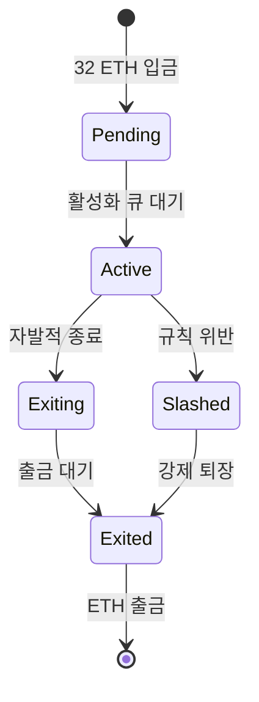
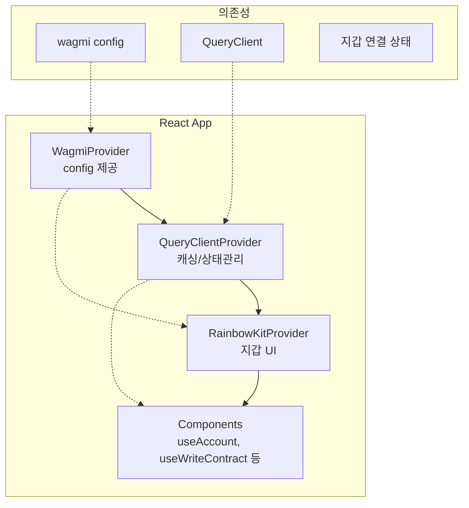

# Week 5 Quiz: PoS/Consensus + RainbowKit

> **제출 방법:** 이 파일을 복사하여 답변을 작성한 후, PR로 제출하세요.
> **평가 기준:** 개념 이해도 중심 - 문법 오류보다 논리적 설명을 중시합니다.

---

## 문제 1: PoS 개념 (객관식)

이더리움이 PoW(작업 증명)에서 PoS(지분 증명)로 전환한 **가장 주요한 이유**는 무엇인가요?

**보기:**
A) 트랜잭션 처리 속도를 10배 이상 높이기 위해
B) 에너지 소비를 99.95% 이상 줄이고 환경 친화적으로 만들기 위해
C) 블록 크기를 늘려서 더 많은 데이터를 저장하기 위해
D) 채굴 장비 없이도 누구나 블록을 생성할 수 있게 하기 위해

**답변:**
<!--
정답 알파벳과 왜 이 답을 선택했는지 설명하세요.
PoW의 문제점과 PoS의 해결책을 연결지어 설명하면 더 좋습니다.
-->B. PoW는 연산경쟁으로 인해 막대한 전기가 소모 되었는 데 ETH를 스테이킹한 참여자가 블록 검증자가 되는 PoS는 이러한
막대한 전기소모를 막을 수 있기 때문이다.


---

## 문제 2: 검증자 역할 (객관식)

이더리움 PoS에서 검증자(Validator)가 수행하는 **두 가지 주요 역할**은 무엇인가요?

**보기:**
A) 블록 채굴(Mining)과 가스 가격 결정
B) 블록 제안(Proposing)과 블록 증명(Attesting)
C) 트랜잭션 전송과 수수료 수집
D) 스마트 컨트랙트 배포와 실행

**답변:**
<!--
정답 알파벳과 각 역할이 무엇을 의미하는지 설명하세요.
-->B. 선택된 증명자는 블록을 제안할 수 있으며 이를 통해 새로운 블록을 만든다. 그 후에 다른 검증자들은 해당 블록이 맞는
지 검증하고 투표를 하는 블록 증명을 한다.


---

## 문제 3: 왜 PoW에서 PoS로? (단답형)

PoW(작업 증명)와 PoS(지분 증명)의 **핵심 차이점**은 무엇인가요?
"자격 증명 방식"과 "보안 보장 방식" 두 관점에서 각각 비교하세요.

**답변:**
<!--
자격 증명 방식:
- PoW:작업 증명 방식은 채굴자가 연산 능력, 즉 컴퓨팅 파워를 통해 막대한 연산 계산 - 해시 계산-을 하여 자격을 얻는다.
- PoS:지분 증명 방식은 증명자가 ETH를 스테이킹(예치)하여 보유한 지분을 통해 블록 생성, 증명에 참여한다.

보안 보장 방식:
- PoW:작업 증명은 컴퓨팅 파워를 통해 자격을 얻기에 공격자가 네트워크를 공격하려면 과반수의 해쉬파워를 얻어야하는 데
이러한 전력, 연산 비용이 보안 보장을 한다.
- PoS:지분 증명은 지분을 예치해두기에 공격자의 행위가 들킬 시 지분을 경제적으로 손실을 보기에 이를 통해 보안을 보장한다.
-->


---

## 문제 4: 슬래싱의 목적 (단답형)

슬래싱(Slashing)은 검증자의 스테이킹된 ETH를 **강제로 소각**하는 패널티입니다.

1) 슬래싱이 발동되는 **두 가지 조건**은 무엇인가요?
2) **왜** 이런 처벌이 필요한가요? 없다면 어떤 문제가 생길 수 있나요?

**답변:**
<!--
1) 슬래싱 조건 (2가지):
   -블록 제안자가 두개의 블록을 제안하는 이중 제안
   -검증자가 두개의 블록에 동시에 투표하는 이중 투표

2) 슬래싱이 필요한 이유:

-->재안자와 검증자의 이중 제안과 이중 투표 행위는 네트워크 합의를 깰 수 있는 행위이기 때문에 이러한 행동을 방지하고자
제안자와 검증자가 스테이킹 한 ETH를 소각하는 슬래싱을 도입하였다.


---

## 문제 5: 체인 선택 규칙 (단답형)

여러 유효한 블록이 동시에 제안되면 **포크(Fork)**가 발생합니다.
이더리움의 LMD-GHOST(Latest Message Driven GHOST) 규칙은 어떻게 "정규 체인"을 선택하나요?

1) LMD-GHOST의 기본 원리는 무엇인가요?
2) **왜** "가장 최근 메시지"를 사용하나요? (오래된 메시지를 사용하면 어떤 문제가?)

**답변:**
<!--
1) LMD-GHOST 원리: 포크가 발생할 시 LMD-GHOST는 검증자들의 지분을 기반으로 여러 유효한 동시 제안 된 블록들의 지분 
가중치를 계산해 가장 높은 가중치를 가진 블록을 따라간다.


2) 최근 메시지 사용 이유:

-->매 슬롯마다 검증자들은 투표를 하는 데 최근 메시지를 사용하지 않는다면 이미 합의가 된 블록에도 영향을 주어 체인
왜곡이 발생할 수 있기 때문이다.


---

## 문제 6: RainbowKit Provider 계층 (빈칸 채우기)

다음 코드의 빈칸을 채워서 RainbowKit을 올바르게 설정하세요.
**Provider 순서가 중요합니다!**

```typescript
'use client';

// TODO: 필요한 스타일 import
_________________________________________

import { RainbowKitProvider } from '@rainbow-me/rainbowkit';
import { WagmiProvider } from 'wagmi';
import { QueryClientProvider, QueryClient } from '@tanstack/react-query';
import { config } from '@/config/wagmi';

const queryClient = new QueryClient();

export default function RootLayout({ children }) {
  return (
    <html lang="ko">
      <body>
        <WagmiProvider config={config}>
          <QueryClientProvider client={queryClient}>
            <RainbowKitProvider>
              {children}
            </RainbowkitProvider>
          </QueryClientProvider>
        </WagmiProvider>
      </body>
    </html>
  );
}
```

**왜 이 순서인가요:**
<!--
Provider 순서가 왜 중요한지 설명하세요.
순서가 잘못되면 어떤 오류가 발생하나요?
-->WagmiProvider가 블록체인 연결 설정을 제공하고 QueryClientProvider가 블록체인 데이터를 캐싱하고 그 담에 
RainbowKitProvider가 ui를 제공하는 순서이기에 순서가 중요하다. 이때 순서가 틀릴 시 필요한 context를 찾지 못하는 오류가
발생한다.


---

## 문제 7: Provider 순서 버그 (취약점 찾기)

다음 코드에서 **문제점**을 찾고 수정하세요:

```typescript
// BAD CODE - 문제점 찾기
'use client';

import '@rainbow-me/rainbowkit/styles.css';
import { RainbowKitProvider } from '@rainbow-me/rainbowkit';
import { WagmiProvider } from 'wagmi';
import { QueryClientProvider, QueryClient } from '@tanstack/react-query';
import { config } from '@/config/wagmi';

const queryClient = new QueryClient();

export default function Providers({ children }) {
  return (
    // 문제가 있는 Provider 순서!
    <QueryClientProvider client={queryClient}>
      <RainbowKitProvider>
        <WagmiProvider config={config}>
          {children}
        </WagmiProvider>
      </RainbowKitProvider>
    </QueryClientProvider>
  );
}
```

**1) 발견한 문제점:**
<!--
무엇이 잘못되었는지 설명하세요.
-->Provider순서가 WagmiProvider, QueryClientProvider, RainbowKitProvider 순서여야 하는데 순서가 잘못되었다.


**2) 왜 이것이 문제인가:**
<!--
이 순서로 인해 어떤 오류가 발생하는지 설명하세요.
-->RainbowKitProvider는 WagmiProvider에 의존하는 데 의존 대상이 안쪽에 있어 context를 찾지 못하는 오류가 발생한다.


**3) 올바른 수정 방법:**
```typescript
// GOOD CODE - 수정된 버전을 작성하세요

<WagmiProvider config={config}>
  <QueryClientProvider client={queryClient}>
    <RainbowKitProvider>
      {children}
    </RainbowKitProvider>
  </QueryClientProvider>
</WagmiProvider>```

---

## 문제 8: 트랜잭션 상태 처리 (빈칸 채우기)

다음 코드의 빈칸을 채워서 트랜잭션 전송 후 **확인 상태를 추적**하세요:

```typescript
'use client';

import { useWriteContract, useWaitForTransactionReceipt} from 'wagmi';

const abi = [
  {
    name: 'increment',
    type: 'function',
    stateMutability: 'nonpayable',
    inputs: [],
    outputs: [],
  },
] as const;

function IncrementButton() {
  const { writeContract, data: hash, isPending } = useWriteContract();

  // TODO: 트랜잭션 확인 상태를 추적하는 hook
  const { isLoading: isConfirming, isSuccess } = useWaitForTransactionReceipt({
    hash,
  });

  return (
    <div>
      <button
        onClick={() =>
          writeContract({
            address: '0x1234...5678',
            abi,
            functionName: 'increment',
          })
        }
        disabled={isPending || isConfirming}
      >
        {isPending ? '서명 대기 중...' : isConfirming ? '확인 중...' : '증가'}
      </button>

      {isSuccess && <p>트랜잭션 성공!</p>}
    </div>
  );
}
```

**트랜잭션 상태 흐름을 설명하세요:**
<!--
1) isPending 상태: 사용자가 버튼을 누를 시 트랜잭션이 요청되며 이때 지갑에서의 서명을 기다라는 상태이다.
2) isConfirming 상태:사용자가 지갑에서 서명을 하여 트랜잭션이 네트워크에 전송되 블록에 포함되어 확이되기를 기다리는 
상태이다.
3) isSuccess 상태: 블록에 트랜잭션이 확인되어 성공적으로 처리된 상태이다.
-->


---

## 문제 9: 검증자 생애주기 (다이어그램 해석)

다음 다이어그램은 이더리움 검증자의 생애주기를 보여줍니다:



**질문:**

1) **Active** 상태에서 검증자가 수행하는 주요 활동은 무엇인가요? Active상태에서 검증자는 블록 제안 또는 블록 검증을
수행한다.


2) Active에서 **Slashed**로 전이되는 조건은 무엇인가요? 이 경우 검증자에게 어떤 일이 발생하나요? 이중 투표, 이중 제안과
같이 규칙 위반 행위를 할 시 스테이킹 된 ETH가 일부 소각되며 검증자는 강제 퇴출 당한다.


3) 검증자가 자발적으로 종료(**Exiting**)하려면 왜 바로 ETH를 출금할 수 없고 대기 기간이 필요한가요?
네트워크 보안을 위해 검증자가 악의적 행위 후 즉시 도망가는 행위나 네트워크에서 검증자가 대량으로 빠져나가는 것을
막기 위해 대기기간이 존재한다.

---

## 문제 10: Provider 계층 구조 (다이어그램 해석)

다음 다이어그램은 RainbowKit/wagmi 앱의 Provider 구조를 보여줍니다:



**질문:**

1) **WagmiProvider**가 가장 바깥에 있어야 하는 이유는 무엇인가요?
WagmiProvider는 앱 전체에 연결 설정, 지갑 연결 상태 등을 제공하는 최상위이기에 가장 밖에 있어야 한다. 

2) **QueryClientProvider**의 역할은 무엇인가요? 없다면 어떤 문제가 발생하나요?
QueryClientProvider는 wagmi가 가져온 블록체인 데이터를 캐싱하고 관리한다. 특히 QueryClientProvider가 없다면 조회를
할때마다 RPC를 계속해서 요청해야 하기에 비용적으로나 효율성적으로나 비효율적이다.

3) 아래 코드에서 `useAccount()` hook이 **"Cannot find WagmiContext"** 오류를 발생시키는 이유는 무엇인가요?

```typescript
// 오류 발생 코드
<QueryClientProvider>
  <RainbowKitProvider>
    <WagmiProvider>  {/* WagmiProvider가 안쪽에 있음 */}
      <MyComponent />  {/* useAccount() 호출 */}
    </WagmiProvider>
  </RainbowKitProvider>
</QueryClientProvider>
```
RainbowKitProvider는 WagmiProvider에 의존하는 데 DainbowKitProvider가 오고나서 WagmiProvider가 와서 오류가 발생한다.

---

## 제출 전 체크리스트

- [ ] 모든 문제에 답변을 작성했는가?
- [ ] 객관식 문제: 정답 선택 **이유**를 설명했는가?
- [ ] 단답형 문제: 2-3문장 이상으로 충분히 설명했는가?
- [ ] 코드 문제: 완성된 코드와 **왜 그렇게 작성했는지** 설명했는가?
- [ ] 다이어그램 문제: 각 질문에 논리적으로 답변했는가?
